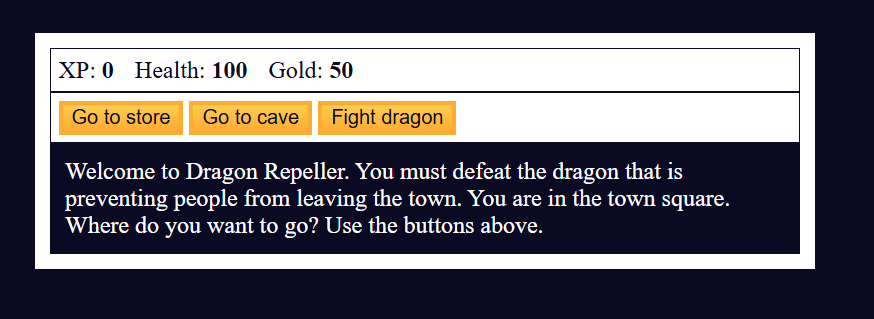
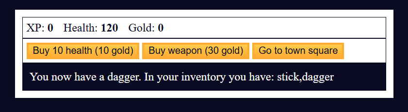
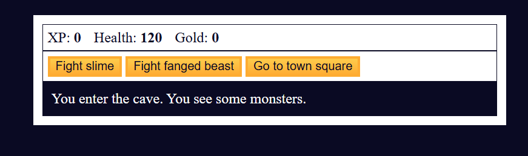
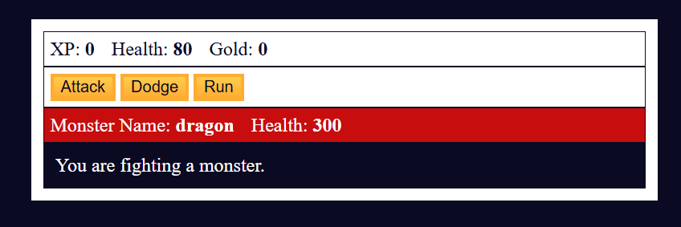
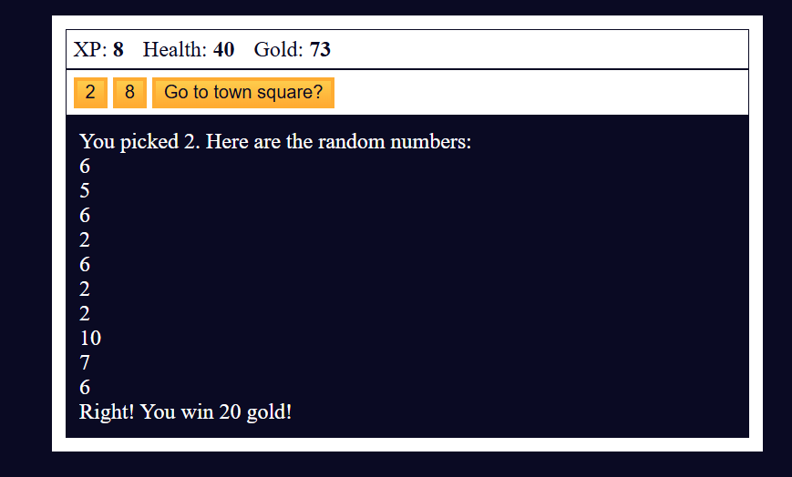

# RPG – Dragon Repeller 🐉

A simple browser-based RPG game built with **HTML, CSS, and JavaScript**.  
The goal is to defeat the dragon that’s preventing people from leaving the town. Along the way, you can explore, fight monsters, buy weapons, and manage your health and gold.

---

## 🎮 How to Play
- Start in the **town square** with some gold, health, and a basic weapon.
- Use the buttons to:
  - Go to the **store** (buy health or weapons).
  - Enter the **cave** (fight monsters).
  - Challenge the **dragon** (final boss).
- Combat is turn-based:
  - Attack with your weapon.
  - Dodge to avoid damage.
  - Run back to town if things get tough.
- Defeat monsters to gain **XP** and **gold**.
- Upgrade your weapons and survive long enough to face the dragon.
- There’s even a hidden **easter egg mini-game** if you discover it!

---

## ✨ Features
- **Stats tracking**: XP, Health, Gold displayed live.
- **Inventory system**: Collect and upgrade weapons.
- **Monster battles**: Slime, fanged beast, and the dragon.
- **Store mechanics**: Buy or sell items to stay alive.
- **Replay option**: Restart the game after winning or losing.
- **Easter egg game**: A fun number-guessing challenge for bonus rewards.

---

## 🛠️ Tech Stack
- **HTML**: Game structure and UI.
- **CSS**: Styling for retro RPG vibes.
- **JavaScript**: Game logic, combat system, and interactivity.

---

## 📸 Screenshots
### 🏙️ Town Square

### 🛒 Store

### 🕸️ Cave Encounter

### 🐉 Dragon Battle

### ☠️ Game Over

### 🏆 Victory Screen

###🤞🥚EasterEgg screen

---

## 🚀 Future Improvements
- Add sound effects and background music.
- Animate attacks and monster health bars.
- More monsters, weapons, and locations.
- Mobile-friendly responsive design.

---

## 🙌 Credits
Created by **Nagaraj Lakshman Naik**, second-year BCA student.  
This project helped me practice DOM manipulation, arrays, objects, and game logic while building something fun and interactive.
