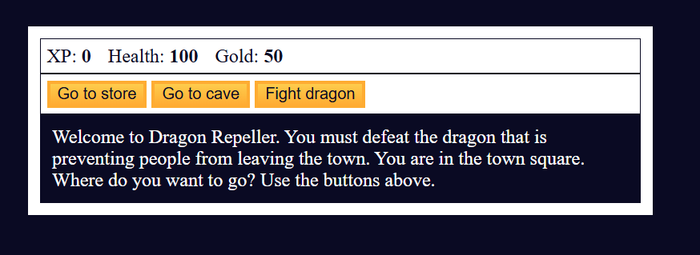
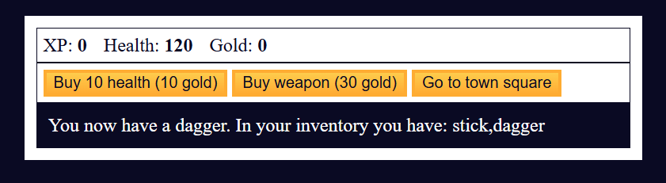
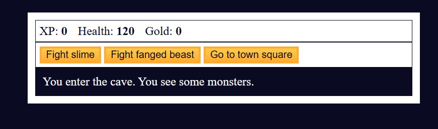
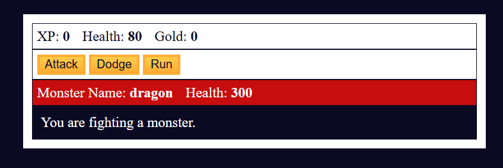
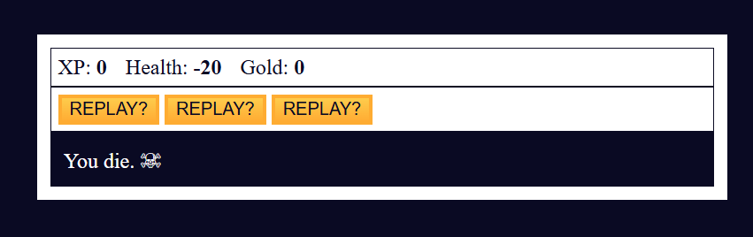
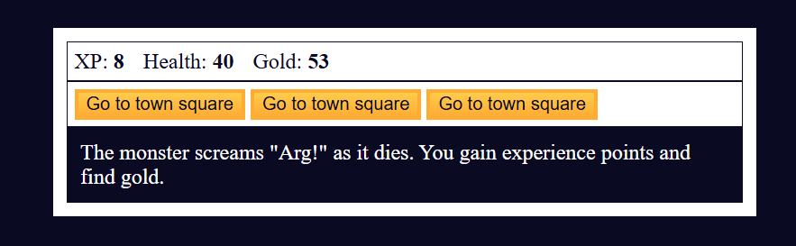
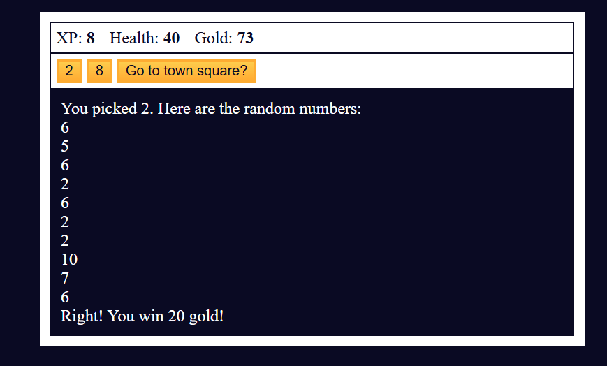

# RPG – Dragon Repeller 🐉

A browser-based RPG game built with **HTML, CSS, and JavaScript**.  
The goal is to defeat the dragon blocking the town’s exit. Along the way, players can explore, fight monsters, buy weapons, and manage health and gold.  

**🔗 Live Demo:** [Dragon Repeller](https://nagarajnaik-dev.github.io/RPG-using-Javascript-HTML-CSS/)

---

## 🎮 How to Play
- Start in the **town square** with gold, health, and a basic weapon.
- Use the buttons to:
  - Visit the **store** (buy health or weapons).
  - Enter the **cave** (fight monsters).
  - Challenge the **dragon** (final boss).
- Combat is turn-based:
  - Attack with your weapon.
  - Dodge to avoid damage.
  - Retreat to town if needed.
- Defeat monsters to gain **XP** and **gold**.
- Upgrade weapons and survive long enough to face the dragon.
- Discover a hidden **easter egg mini-game** for bonus rewards.

---

## ✨ Features
- **Live stats tracking**: XP, Health, Gold.
- **Inventory system**: Collect and upgrade weapons.
- **Monster battles**: Slime, fanged beast, and the dragon.
- **Store mechanics**: Buy or sell items to stay alive.
- **Replay option**: Restart after winning or losing.
- **Easter egg mini-game**: A number-guessing challenge with rewards.

---

## 🛠️ Tech Stack
- **HTML**: Game structure and UI.
- **CSS**: Styling with retro RPG vibes.
- **JavaScript**: Game logic, combat system, and interactivity.

---

## 📸 Screenshots

### 🏙️ Town Square
  
*Start your journey with basic stats and options.*

### 🛒 Store
  
*Buy health or weapons to prepare for battles.*

### 🕸️ Cave Encounter
  
*Face monsters like slime and fanged beasts.*

### 🐉 Dragon Battle
  
*Final boss fight against the dragon with 300 health.*

### ☠️ Game Over
  
*Replay option after defeat — keep trying until you win!*

### 🏆 Victory Screen
  
*Celebrate your victory after defeating the dragon.*

### 🎁 Easter Egg
  
*A hidden surprise for curious players — can you find it?*

---

## 🚀 Future Improvements
- Add sound effects and background music.
- Animate attacks and monster health bars.
- Introduce more monsters, weapons, and locations.
- Make the game mobile-friendly with responsive design.

---

## 🧑‍💻 Author
Created by **Nagaraj Lakshman Naik**  
This project explores web development concepts such as DOM manipulation, arrays, objects, and game logic, while delivering a fun and interactive RPG experience.
